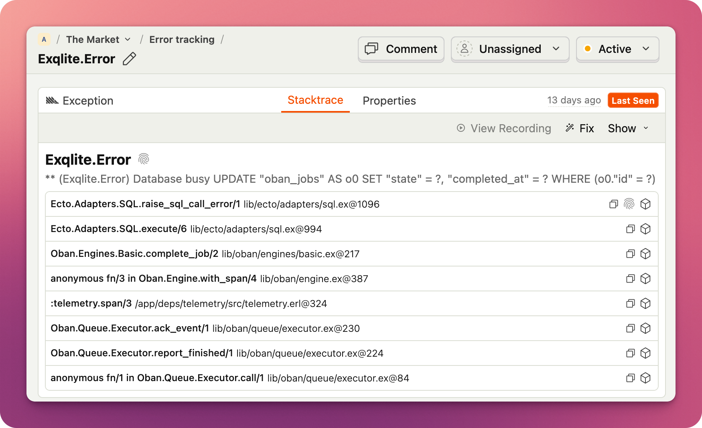

# PostHog Elixir SDK

[](https://hex.pm/packages/posthog)
[](https://hexdocs.pm/posthog)

A powerful Elixir SDK for [PostHog](https://posthog.com)

## Features

- Analytics and Feature Flags support
- Error tracking support
- Powerful process-based context propagation
- Asynchronous event sending with built-in batching
- Overridable HTTP client
- Support for multiple PostHog projects

## Getting Started

Add `PostHog` to your dependencies:

```elixir
def deps do
  [
    {:posthog, "~> 0.3"}
  ]
end
```

Configure the `PostHog` application environment:

```elixir
config :posthog,
  enable: true,
  enable_error_tracking: true,
  public_url: "https://us.i.posthog.com",
  api_key: "phc_my_api_key",
  in_app_otp_apps: [:my_app]
```

For test environment, you want to enable test_mode:

```elixir
config :posthog,
  test_mode: true
```

Optionally, enable [Plug integration](`PostHog.Integrations.Plug`).

You're all set! 🎉 For more information on configuration, check the `PostHog.Config` module
documentation and the [advanced configuration guide](advanced-configuration.md).

## Capturing Events

To capture an event, use `PostHog.capture/2`:

```elixir
iex> PostHog.capture("user_signed_up", %{distinct_id: "distinct_id_of_the_user"})
```

You can pass additional properties in the last argument:

```elixir
iex> PostHog.capture("user_signed_up", %{
  distinct_id: "distinct_id_of_the_user",
  login_type: "email",
  is_free_trial: true
})
```

## Special Events

`PostHog.capture/2` is very powerful and allows you to send events that have
special meaning. For example:

### Create Alias

```elixir
iex> PostHog.capture("$create_alias", %{distinct_id: "frontend_id", alias: "backend_id"})
```

### Group Analytics

```elixir
iex> PostHog.capture("$groupidentify", %{
  distinct_id: "static_string_used_for_all_group_events",
  "$group_type": "company",
  "$group_key": "company_id_in_your_db"
})
```

## Context

Carrying `distinct_id` around all the time might not be the most convenient
approach, so `PostHog` lets you store it and other properties in a _context_.
The context is stored in the `Logger` metadata, and PostHog will automatically
attach these properties to any events you capture with `PostHog.capture/3`, as long as they
happen in the same process.

```elixir
iex> PostHog.set_context(%{distinct_id: "distinct_id_of_the_user"})
iex> PostHog.capture("page_opened")
```

You can scope context by event name. In this case, it will only be attached to a specific event:

```elixir
iex> PostHog.set_event_context("sensitive_event", %{"$process_person_profile": false})
```

You can always inspect the context:

```elixir
iex> PostHog.get_context()
%{distinct_id: "distinct_id_of_the_user"}
iex> PostHog.get_event_context("sensitive_event")
%{distinct_id: "distinct_id_of_the_user", "$process_person_profile": true}
```

## Feature Flags

`PostHog.FeatureFlags.check/2` is the main function for checking a feature flag.

```elixir
# Simple boolean feature flag
iex> PostHog.FeatureFlags.check("example-feature-flag-1", "user123")
{:ok, true}

# Note how it automatically sets `$feature/example-feature-flag-1` property in the context
iex> PostHog.get_context()
%{"$feature/example-feature-flag-1" => true}

# It will attempt to take distinct_id from the context if it's not provided
iex> PostHog.set_context(%{distinct_id: "user123"})
:ok
iex> PostHog.FeatureFlags.check("example-feature-flag-1")
{:ok, true}

# You can also pass a map with body parameters that will be sent to the /flags API as-is
iex> PostHog.FeatureFlags.check("example-feature-flag-1", %{distinct_id: "user123", groups: %{group_type: "group_id"}})
{:ok, true}

# It returns variant if it's set
iex> PostHog.FeatureFlags.check("example-feature-flag-2", "user123")
{:ok, "variant2"}

# Returns error if feature flag doesn't exist
iex> PostHog.FeatureFlags.check("example-feature-flag-3", "user123")
{:error, %PostHog.UnexpectedResponseError{message: "Feature flag example-feature-flag-3 was not found in the response", response: ...}}
```

If you're feeling adventurous and/or is simply writing a script you can use the `PostHog.FeatureFlags.check!/2` helper instead and it will return a boolean or raise an error.

```elixir
# Simple boolean feature flag
iex> PostHog.FeatureFlags.check!("example-feature-flag-1", "user123")
true

# Works for variants too
iex> PostHog.FeatureFlags.check!("example-feature-flag-2", "user123")
"variant2"


# Raises error if feature flag doesn't exist
iex> PostHog.FeatureFlags.check!("example-feature-flag-3", "user123")
** (PostHog.UnexpectedResponseError) Feature flag example-feature-flag-3 was not found in the response
```

## Error Tracking

Error Tracking is enabled by default.



You can always disable it by setting `enable_error_tracking` to false:

```elixir
config :posthog, enable_error_tracking: false
```

## Multiple PostHog Projects

If your app works with multiple PostHog projects, PostHog can accommodate you. For
setup instructions, consult the [advanced configuration guide](guides/advanced-configuration.md).

## Developing locally

You should be able to fetch dependencies and run tests right away:

```
mix deps.get
mix test
```

To run integration test suite that sends real events to the API:

1. Create a test PostHog project and obtain an API key.
2. Create `config/integration.exs` config that will be used for integration tests:
  ```
  cp config/integration.example.exs config/integration.exs
  ```
3. Put API key into `config/integration.exs`
4. Run integration tests
  ```
  mix test --only integration
  ```

If you want to play with PostHog events in IEx, you'll need to create
`config/dev.exs` and configure your dev instance to your liking. Here a
minimal example:

```elixir
import Config

config :posthog,
  public_url: "https://us.i.posthog.com",
  api_key: "phc_XXXX"
```